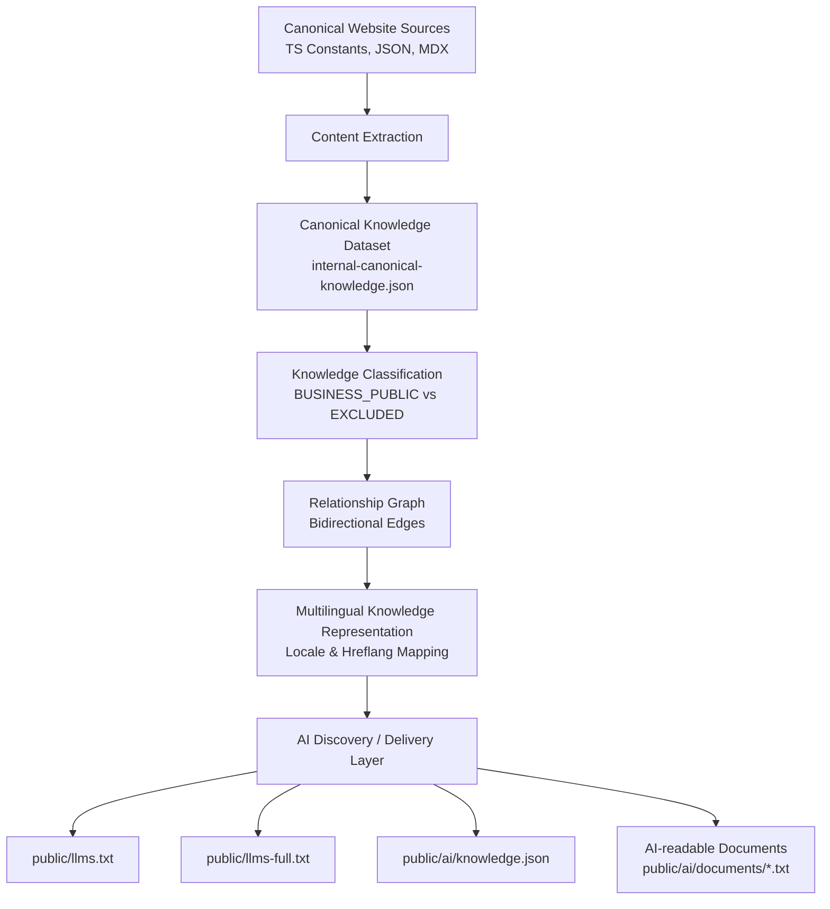

# OBRIVE AI KNOWLEDGE BRAIN
## Complete Technical & Implementation Documentation

**Status**: COMPLETE AND FROZEN  
**Deployment Status**: NOT YET DEPLOYED TO PRODUCTION  
**Documentation Date**: October 2, 2026  

---

## Executive Summary

Historically, the public information on the Obrive website was distributed across multiple sources and structures, including scattered TypeScript constants, JSON files, MDX documents, Next.js page components, and SEO structures. This fragmentation meant that extracting a cohesive representation of our services, products, industries, use cases, technologies, case studies, blogs, FAQs, pricing, contact details, and relationships was difficult for search engines and AI agents.

The Obrive AI Knowledge Brain was built to create a structured, deterministic, AI-readable representation of this public business knowledge. By aggregating dispersed data into a unified canonical pipeline, the architecture produces machine-readable outputs that allow AI and search systems to easily discover, crawl, and understand Obrive's entire public footprint.

## Business Objective

The implementation of the AI Knowledge Brain accomplished the following practical goals:
- **Enhanced AI Discovery**: Make Obrive's public knowledge structured and easily discoverable by modern AI crawler and search systems.
- **Unified Knowledge Representation**: Create a single structured source-of-truth for business information.
- **Reduced Fragmentation**: Connect isolated content relationships across the platform.
- **Explicit Relational Graph**: Provide explicit, bidirectional relationships between services, industries, use cases, technologies, FAQs, and case studies.
- **Machine-Readable Documentation**: Expose public documentation in normalized text formats without frontend syntaxes.
- **Multilingual Integrity**: Preserve locale identity and multi-language routing for global audiences.
- **Security & Privacy Boundary Enforcement**: Ensure internal routes, private information, and regional sub-brands (e.g., India) remain completely isolated.
- **Reproducible Extraction**: Ensure the AI knowledge layer is completely regeneratable from canonical source data.

## Before Implementation — Existing Content Architecture

An audit of the Obrive repository revealed that business information existed across multiple disparate sources rather than one canonical AI-oriented representation. The existing architecture utilized:
- Next.js public dynamic and static routes (`src/app`)
- TypeScript data and constants (`src/constants/pages/`, `src/lib/`)
- JSON content files (`src/data/blogs.json`, `src/data/case-studies.json`)
- MDX documentation (`src/content/`)
- Localized dictionaries and SEO structure implementations
- Scattered metadata generation logic tightly coupled to page components

## Knowledge Brain Architecture

The Knowledge Brain architecture follows a deterministic pipeline that extracts canonical data and transforms it into AI-ready outputs, ensuring 100% parity with the live website.



## Phase-by-Phase Implementation History

### Phase 1 — Knowledge Foundation
The foundation involved conducting a comprehensive inventory of the repository, identifying scattered content, establishing strict entity identities (e.g., `service:slug`), mapping internal sources, and discovering implicit content relationships hidden inside page constants.

### Phase 2 — Canonical Knowledge Model
A unified JSON schema was developed to represent all entities with stable identities, source references, relationship representations, and provenance handling. We classified items based on ambiguity rules and defined a strict canonical schema to ensure the data was predictable.

### Phase 2.1 / 2.2 — Data Reconciliation
During this phase, we reconciled duplicate and variant FAQs, established accurate AR sector relationship mappings, resolved brand naming ambiguities (e.g., OBCREW), and resolved an MDX indexing issue involving path collisions. 

### Phase 3 — Full-Fidelity Extraction
Comprehensive extraction scripts were built to capture services, products, industries, AR sectors, use cases, technologies, case studies, blogs, FAQs, MDX content, pricing, contact structures, and JSON-LD structured data elements.

### Phase 3.5–3.7 — Runtime / Route Verification
We audited the concrete public route inventory and verified runtime rendering, confirming that metadata and JSON-LD resolution exactly matched the canonical dataset. We also verified multilingual routing and patched English leakage detected in non-English routes.

### Phase 4 — Knowledge Relationship Graph
We constructed a bidirectional knowledge relationship graph complete with edge provenance and confidence scoring. This allowed cross-traversal from entities like "Industries" to corresponding "Case Studies" or "Technologies", establishing a formal query resolver and retrieval layer.

### Phase 5 — Multilingual Knowledge Representation
The `.com` commercial language architecture was successfully mapped. This includes English and 14 non-English locales. The knowledge representation ensures that locale-aware identity references are maintained, and RTL support is provided where applicable. Strict regional exclusions (India/Hindi) were implemented at the architectural level.

### Phase 6 — AI Discovery & Delivery
The final delivery layer was implemented, dynamically generating `llms.txt`, `llms-full.txt`, `knowledge.json`, and individualized AI document exposure (`public/ai/documents/*.txt`). This structure allows robots and AI crawlers to effectively access the public data without navigating complex JavaScript payloads.

### Final Gap Closure
During the final pre-deployment forensic audit, two major gaps were identified and corrected:
1. **Runtime Metadata Parity**: Initially, the generated AI metadata drifted from the actual runtime Next.js metadata. This was resolved by centralizing the metadata logic.
2. **Blog and Case Study Content**: The substantive content bodies for blogs and case studies were initially missing or incomplete in the AI layer due to faulty JSON section mapping. The extraction script (`generate-llms.ts`) was updated to correctly extract dynamic structures (`sections`, `challenge`, `approach`, etc.).

## Runtime Metadata Resolver

To ensure the AI representations never drift from actual Next.js output, metadata generation was centralized in a shared resolver architecture located at:
`src/lib/metadata-resolvers.ts`

**Architecture**:
```text
Next.js route   ----->   Shared metadata resolver   ----->   Runtime metadata
                                    ^
AI generation   --------------------|                       ----->   AI metadata
```

This guarantees deterministic parity because both the frontend page components (Services, Products, Industries, Blogs, Case Studies, Technologies, Use Cases) and the AI Knowledge generation scripts rely on the exact same functions (`resolveServiceMetadata`, `resolveBlogMetadata`, etc.). It inherently prevents duplicate logic, eliminates SEO drift, and allows automated forensic testing.

## Blog Content Extraction

Blogs are dynamically extracted from `src/data/blogs.json`. The knowledge generator processes the `title`, `description`, `sections` array, inner content arrays, and `cta` blocks to formulate a unified canonical body text, appending it directly to `public/llms-full.txt`.

A previous extraction bug involving incorrect targeting of `s.heading` (which missed content blocks) was corrected in `scripts/knowledge/generate-llms.ts`. The generator now successfully processes 100% of the internal blog structures.

**Verified Coverage**: 100 / 100 Blogs

## Case Study Content Extraction

Case studies are extracted from `src/data/case-studies.json`. The generator processes fields including `title`, `overview`, `challenge`, `approach`, and `architecture`. 

This ensures that the AI representation exposes the substantive public business outcomes of the case study, rather than merely exposing the slug and title metadata.

**Verified Coverage**: 24 / 24 Case Studies

## Public Document Exposure

The Knowledge Brain extracts the English MDX documentation (Privacy Policy, Terms, Support guidelines, SOC-2 reports, etc.) and exposes them as normalized, standalone AI-readable `.txt` derivatives under `public/ai/documents/`. 

The original MDX remains unchanged. All frontend React/MDX syntaxes (like `<Button>` or layout wrappers) are carefully stripped out, while preserving headings, paragraphs, and lists. These derivatives are then directly referenced inside `public/llms.txt`.

**Verified Coverage**: 48 / 48 documents verified.

## Final Knowledge Entity Counts

The final verified canonical dataset (`src/data/internal-canonical-knowledge.json`) contains precisely **1,854** entities. 

| Classification | Count |
| :--- | :--- |
| **BUSINESS_PUBLIC** | 1,106 |
| **DOCUMENT_PUBLIC** | 48 |
| **METADATA_ONLY** | 25 |
| **PROVENANCE_ONLY** | 1 |
| **AMBIGUOUS** | 1 |
| **LOCALIZED_DOCUMENT** | 672 |
| **EXCLUDED_FROM_OBRIVE_COM** | 1 |
| **TOTAL** | **1,854** |

## Final Content Coverage

Verified public content distributions across the canonical graph:
- **Services**: 16
- **Products**: 4
- **Industries**: 8
- **AR Sectors**: 21
- **Use Cases**: 8
- **Technologies**: 8
- **Case Studies**: 24
- **Blogs**: 100
- **FAQs**: 873
- **Public Documents**: 48
- **Pricing Packages**: 16
- **Contact**: 26 (non-excluded entities)

*(Note: The 8 Canonical Industries act as primary standalone Next.js routes, whereas the 21 AR Sectors are data sub-entities mapped as dropdowns and graph relations without their own dedicated Next.js routing.)*

## Relationship Graph

The graph builder constructs a semantic web of interconnected business data:
- **757 Validated Edges**: Verified bidirectional relationships across the canonical model.
- **Graph Traversal & Retrieval**: Enables relationships between entities (e.g., connecting a Service directly to its relevant Case Studies and Technologies).
- **Confidence & Provenance**: Edges are tagged with source provenance to ensure reliability.

## AI Discovery Outputs

The build pipeline dynamically regenerates the following files:

### `public/llms.txt`
The master AI discovery index serving as the primary entry point for AI systems. It provides high-level descriptions and direct URIs to the more comprehensive files.

### `public/llms-full.txt`
An expanded, structured prose representation of Obrive. It contains the full business content exposure, including all substantive blog and case-study content, mapped clearly via markdown fragments.

### `public/ai/knowledge.json`
The structured, machine-readable canonical graph. It explicitly declares schema versions, entities, relationships, raw metadata, and content references for advanced systems to traverse programmatically.

## Multilingual Architecture

The `.com` commercial language architecture consists of English (`en`) and 14 non-English locales: `ar`, `es`, `pt`, `fr`, `de`, `nl`, `sv`, `it`, `zh`, `ja`, `ko`, `ms`, `id`, `th`.

All entities enforce locale-aware identity references and localized knowledge representation. 

**Strict Exclusion Notice (India / Hindi)**:
India and Hindi are intentionally excluded from `Obrive.in`. There are absolutely no `/in` routes, `/hi` routes, `hi-IN` exposures, or India contact details in the Knowledge Brain. India traffic is handled through a separate `obrive.in` domain architecture. The generator uses a strict `/\/(in|hi)(\/|$)/` regex constraint to enforce this boundary securely.

## Security & Data Isolation

The AI Knowledge Brain employs multiple security boundaries:
- **Secret Detection**: Automated security scanning of generated outputs to prevent API keys and database credentials from leaking.
- **Data Isolation**: Internal routes, administration data, and private employee information are entirely bypassed during extraction.
- **Explicit Classification**: Only items classified explicitly as `BUSINESS_PUBLIC` or `DOCUMENT_PUBLIC` make their way into the generated AI exposure files. 

## Validation & Testing

The Knowledge Brain includes an automated verification suite ensuring drift protection and parity.

| Command | Purpose | Result |
| :--- | :--- | :--- |
| `npm run build` | Ensures Next.js production build succeeds | **PASS** (293/293 pages) |
| `npx tsc --noEmit` | Checks for TypeScript strict type integrity | **PASS** |
| `npx tsx scripts/knowledge/validate-ai-output.ts` | Validates JSON validity, schema structure, and executes security/privacy scans | **PASS** |
| `npx tsx scripts/knowledge/test-ai-discovery.ts` | Tests entity resolution and text extraction across 8 specific query domains | **PASS** |
| `npx tsx scripts/knowledge/exhaustive-audit.ts` | Exhaustive 100% forensic parity sweep of all metadata, full-content blogs, and case studies | **PASS** |

## Final Metadata Parity

A forensic test sweep verified 100% parity across all **168 dedicated metadata routes** on the application.

*(The 21 AR sectors are accurately excluded from route-level metadata testing as they are data sub-entities and do not have standalone Next.js routes.)*

- **Title parity**: 168 / 168
- **Description parity**: 168 / 168
- **Keywords parity**: 168 / 168

## Final Content Parity

- **Blogs**: 100 / 100
- **Case Studies**: 24 / 24
- **Public Documents**: 48 / 48

Parity was verified by the `exhaustive-audit.ts` script, asserting that the substantive text from the JSON structures exactly matches the rendered content block mapped into `llms-full.txt`.

## Files / Components Changed

| File | Purpose | Change |
| :--- | :--- | :--- |
| `src/lib/metadata-resolvers.ts` | Metadata Logic Centralization | Extracted page-level SEO code into shared reusable modules for deterministic AI generation. |
| `scripts/knowledge/generate-llms.ts` | AI Output Generator | Refactored to properly extract nested blog/case-study content and strictly enforce India boundary regex. |
| `scripts/knowledge/exhaustive-audit.ts` | Forensic Verification Tool | Added exhaustive looping over 168 entities to perform complete automated metadata parity checks against Next.js. |
| `.github/workflows/ai-knowledge-brain.yml` | CI Drift Protection | Created to automatically enforce that AI artifacts remain synchronized with the source code repository. |

## Current Deployment Status

**Status**: Implementation complete and frozen.
**Production**: Not yet deployed.
**Production crawl/index verification**: Pending until deployment.

*(Note: Because the implementation is not yet live on the production domain, external search engines and AI crawlers have not yet discovered or indexed this architecture.)*

## How the System Should be Maintained

Generated AI files (`public/llms.txt`, `public/llms-full.txt`, `public/ai/knowledge.json`) should **never** be manually edited.

**Future Workflow**:
```text
Canonical content changes (e.g. adding a Blog to JSON)
        ↓
Knowledge generation (run: npx tsx scripts/knowledge/run-generator.ts)
        ↓
Validation
        ↓
Commit regenerated output files
        ↓
Deployment
```
Developers can continue adding/changing services, products, blogs, case studies, FAQs, and documents via their respective canonical JSON sources. The CI pipeline will automatically detect if a developer forgets to regenerate the AI outputs and will block the PR until `scripts/knowledge/run-generator.ts` is run locally.

## Future Deployment Checklist

For the eventual production deployment, please verify the following:
- [ ] Next.js Production Build passes
- [ ] TypeScript checks pass
- [ ] AI validation suite passes
- [ ] AI discovery tests pass
- [ ] All regenerated `.txt` and `.json` artifacts are committed to Git
- [ ] No secrets found in outputs
- [ ] `robots.txt` configuration reviewed
- [ ] `https://obrive.in/llms.txt` is accessible
- [ ] `https://obrive.in/llms-full.txt` is accessible
- [ ] `https://obrive.in/ai/knowledge.json` is accessible
- [ ] Production smoke test passes
- [ ] Canonical and hreflang tag verification
- [ ] Sitemap accessibility

## Final Status

The Obrive AI Knowledge Brain implementation is complete and frozen at the codebase level, with canonical extraction, relationship modeling, multilingual representation, AI discovery outputs, runtime metadata parity, full blog/case-study content exposure, public documentation exposure, and automated validation securely in place.

Production deployment and external crawler/indexing verification remain pending because the website has not yet been deployed.
