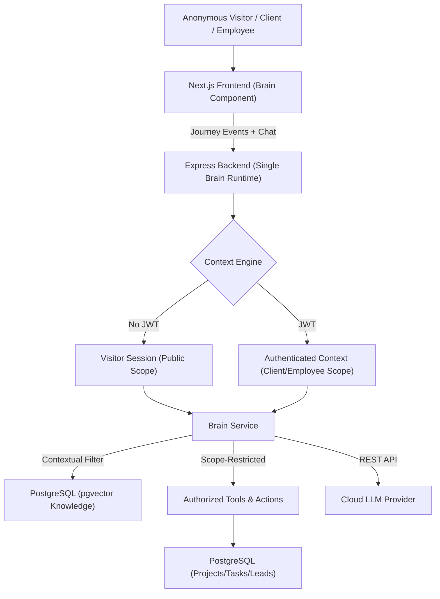

# OBRIVE BRAIN
# ZERO-TO-ONE ARCHITECTURE

## Executive Summary
This document defines the architecture for the "Obrive Brain," an intelligence layer designed to integrate with the existing Obrive application. Crucially, this architecture is derived *exclusively* from an analysis of the current `origin/main` repository (as of September 2026), discarding all previous assumptions, blueprints, and external AI agent documents. 

The Obrive Brain is **not** merely an employee chatbot or a generic RAG wrapper. It is defined as **a shared intelligence layer for the entire Obrive ecosystem**. It must natively support anonymous website visitors, potential leads, existing authenticated clients, employees, internal operators, and future product users—all running on **one underlying Brain runtime** with dynamically applied context and permission boundaries.

## Current Codebase Understanding
Based on a thorough inspection of the repository (including `package.json`, `backend/package.json`, `backend/prisma/schema.prisma`, and `src/`):

- **Frontend:** Next.js 15 (Turbopack), React 19, Tailwind CSS v4, Framer Motion, Rive Canvas, Lucide React.
- **Backend:** Node.js, Express, Prisma ORM, Socket.io, LiveKit Server SDK, Node-cron.
- **Database:** PostgreSQL (via Prisma). Contains standard relational entities (`users`, `projects`, `tasks`, `events`, `work_sessions`, `messages`, `community_posts`, `room_configs`). There are currently no entities for visitor session tracking or lead qualification.
- **Infrastructure:** Currently relies solely on Node.js and PostgreSQL. **No Redis, BullMQ, or dedicated vector databases exist.**
- **Auth:** JWT-based authentication with `bcrypt` in the Express backend (`users` table).
- **Style Invariants:** Strict adherence to the `Michroma` font (`var(--font-michroma)`) and brand color palettes, as dictated by `AGENTS.md`.

## Existing AI Systems
- **CURRENT:** A third-party client-side widget in `public/ai/ai.js`. It injects `@elevenlabs/convai-widget-embed` into the DOM and styles it as the "Orion Assistive Ball".
- **CURRENT:** UI text references in `src/app/(public)/coming-soon/page.tsx` mentioning "Ella is on the way".
- **VERIFIED FACT:** There is zero backend AI routing, agent frameworks, LLM provider integrations, or vector storage systems present in the backend repository. 

## Core Product Definition
The Brain is an intelligence layer that understands the context of a person's interaction with Obrive, understands Obrive's knowledge and live application state, and can guide, recommend, remember, reason, and eventually act through authorized capabilities. It works regardless of whether the interaction is through chat, proactive contextual prompts, or implicit background orchestration.

## Brain Vision: The Ecosystem Intelligence Layer
To maintain a cohesive product, there will NOT be a separate "PublicBrain", "ClientBrain", or "EmployeeBrain". There is **one Brain runtime**. This runtime shifts capabilities dynamically based on:
`identity/context + permission scope + knowledge + memory + tools + policies`

### 1. Anonymous Visitor Brain (Public Website Intelligence)
The public website experience is a **first-class use case**. A visitor may have no login, but the Brain builds intent based on the **Visitor Context Engine**:
`VISITOR SESSION + CURRENT PAGE + CURRENT JOURNEY + EXPLICIT USER INPUT + KNOWLEDGE = VISITOR INTENT`
- **Capabilities:** Explain products (e.g., ObNest, ObMove), compare offerings, answer FAQs, guide visitors, and collect structured enquiries.
- **Why it’s useful:** If a visitor says, "What does ObNest do?", the Brain knows they previously read about "Virtual Property Tours", are located in the UAE, and tailors the response specifically to real estate needs in Dubai, recommending relevant case studies.

### 2. Lead Intelligence
As the visitor converses or browses, the Brain extracts structured intent (e.g., `country = Germany`, `industry = Retail`, `need = Indoor Navigation`). 
When authorized, the Brain prepares a structured lead summary consisting of requirements, use cases, and budget/timeline before safely handing it off to contact/CRM flows. It does not blindly send emails without explicit policy consent.

### 3. Client Brain
For authenticated users identified as clients, the Brain inherits the organization boundary.
- **Capabilities:** Project intelligence, task lookups, document search, issue detection, and project summaries.

### 4. Employee & Operations Brain
For authenticated users identified as employees/admins, the Brain adopts deep access based on roles.
- **Capabilities:** Internal knowledge, workflow automation, global operational intelligence, and approved write actions.

## Context Hierarchy Model
The Brain must always know its active context boundary to guarantee security and relevance:
- **VISITOR:** `Session → Journey → Intent → Public Knowledge`
- **CLIENT:** `User → Organization → Project → Product → Activity → Client Knowledge`
- **EMPLOYEE:** `User → Organization → Role → Project → Task → Internal Knowledge`
- **OPERATIONS:** `Organization → Global System Context → Permitted Data`

## Architecture Decision
- **DECISION:** **Integrated Backend Module (Monolith).** The Brain will be built as a new service layer *within* the existing Express backend (`backend/src/ai`).
- **WHY:** The current infrastructure is an Express/Postgres monolith. A separate microservice would duplicate JWT auth, Prisma models, and require new inter-service networking. 
- **ALTERNATIVES REJECTED:** Microservice agent frameworks (Python/Go) were rejected because the current infrastructure lacks service mesh/queueing.
- **RUNTIME:** The single Brain runtime will evaluate JWT claims (or lack thereof for visitors) on every request to determine the Context Hierarchy.

## Data & Knowledge Architecture
- **SOURCE:** 
  - *Public:* Case studies (`casestudies_data.json`), FAQs, Website Pages, Public Pricing.
  - *Private:* Prisma tables (`projects`, `tasks`, `users`, future documents).
- **STORAGE (NEW):** PostgreSQL `pgvector`. This avoids introducing a new database dependency.
- **KNOWLEDGE SEGREGATION:** Vector metadata must strictly define visibility (e.g., `visibility: "public" | "client_org_1" | "internal"`).

## Session Memory & Database Model (NEW)
We must introduce new Prisma entities for the public/lead experience.
- **`visitor_sessions`**: Tracks anonymous browser sessions, country/locale, and current journey events.
- **`visitor_events`**: Tracks page views or interaction nodes without relying on chat.
- **`ai_conversations` & `ai_messages`**: Stores conversation turns, linked to *either* a `visitor_session` or an authenticated `user_id`.
- **Memory Rules:** Anonymous session memory is strictly short-lived. No permanent personal memory is created for anonymous visitors without explicit cookie/privacy consent.

## Security & Permission Architecture
Permissions separate the four tiers (Visitor, Lead, Client, Employee) within the single runtime.
- **Public Visitors:** NEVER receive private client data, employee data, internal documents, or analytics. Vector searches for visitors automatically inject a `WHERE visibility = 'public'` filter.
- **Authentication:** Authenticated requests reuse the existing Express JWT middleware. Unauthenticated requests are assigned a temporary encrypted session ID via HTTP-only cookies.
- **Tool Execution:** Tool calls evaluate the Context Hierarchy. If the LLM attempts to call `get_project_status(id)` on a public session, the backend forcibly rejects it.

## Proactive Intelligence (Controlled)
The Brain works even without active chat. Using the `visitor_events` data, if a user repeatedly cycles between "Automotive" and "ObMove", the Brain can surface a gentle, non-intrusive prompt: *"Looking to build an automotive virtual showroom?"*
- **Constraints:** Must be rate-limited, context-aware, privacy-compliant, and easily dismissible (no aggressive pop-ups).

## Observability
- Log all Brain requests, token usage, latency, context-tier (Visitor/Client/Employee), and tool failures to a new Prisma table `ai_audit_logs`.
- Track lead conversion rates where a visitor session upgrades to a lead enquiry.

## MVP Redefinition
The MVP MUST center on **Public Website Intelligence** as the foundation, proving the Brain can safely handle the base of the context hierarchy before extending deeply into internal operations.

**MVP Includes:**
1. Public website knowledge (RAG over FAQs/Case Studies).
2. Contextual visitor conversations (understanding current page/journey).
3. Session memory via anonymous tracking.
4. Product/solution recommendations based on journey intent.
5. Structured lead qualification and safe contact/demo handoff.
6. Foundation for authenticated client context (basic auth boundaries).
7. Audit/observability for AI responses.
8. Safe event/context ingestion.

## Implementation Roadmap
- **Phase 1: Foundation & Data Model:** Add `pgvector` to PostgreSQL. Update `schema.prisma` with `visitor_sessions`, `visitor_events`, `ai_conversations`, `ai_messages`, and `knowledge_chunks`.
- **Phase 2: Public Knowledge Ingestion:** Parse `casestudies_data.json` and static Obrive content into public vectors.
- **Phase 3: Context Engine & Runtime:** Build the single Brain Express service that differentiates between Anonymous and Authenticated requests, applying strict knowledge filters.
- **Phase 4: Event & Journey Tracking:** Implement frontend middleware to securely send page transitions and journey data to `visitor_events`.
- **Phase 5: Frontend Experience:** Replace the third-party ElevenLabs widget with a native React component that supports both active chat and subtle proactive prompts.
- **Phase 6: Lead Intelligence:** Implement structured extraction tools to safely summarize lead requirements.

## Final Architecture Diagram

## Final Implementation Checklist
- [ ] Initialize `pgvector` on Postgres instance.
- [ ] Update `schema.prisma` with visitor, memory, and vector tables.
- [ ] Create Context Engine to parse session/JWT boundaries.
- [ ] Register new Express routes for Brain interactions and event telemetry.
- [ ] Create data ingestion script for public Obrive docs.
- [ ] Build custom Next.js UI component for chat and proactive engagement.
- [ ] Remove `public/ai/ai.js`.
